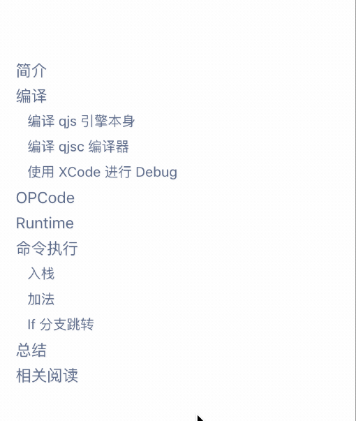
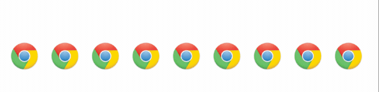

# React Fisheye 鱼眼效果

[](https://badge.fury.io/js/react-fisheye)

React-fisheye is a react component implements fisheye effect.




# Installation

Use npm/yarn to install react-fisheye.

```
yarn add react-fisheye
```

# Usage

`data` property should be an array of data objects. Data item should
contain 'key' property.

| Property | Type | Default |
| -------- | ---- | ------- |
| data | object[] | undefined |
| multiple | number | 1 |
| mode | "vertical" \| "horizontal" | "vertical" |
| render | function | undefined |

```javascript
const list = [
  { key: "aaa" },
  { key: "bbb" },
  { key: "ccc" },
  { key: "ddd" },
  { key: "eee" },
  { key: "fff" },
  { key: "ggg" },
  { key: "vvv" }
];

function App() {
  return (
    <div className="App">
      <h1>Hello CodeSandbox</h1>
      <h2>Start editing to see some magic happen!</h2>
      <FishEye
        multiple={0.35}
        data={list}
        render={(item, index) => {
          return <div>{item.key + ' ' + index}</div>
        }}
      />
    </div>
  );
}
```
